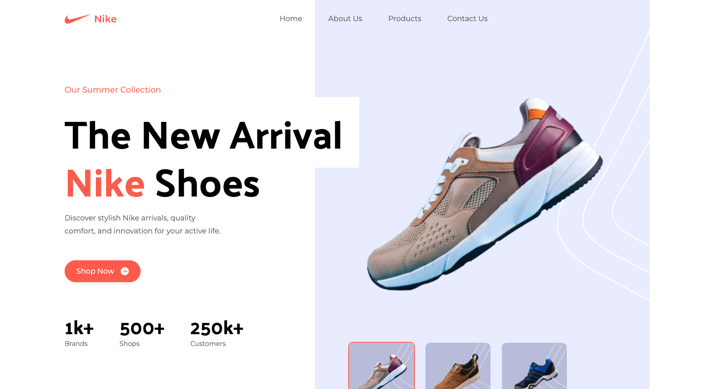

# Nike Landing Page App

## Table of contents

- [Overview](#overview)
  - [The challenge](#the-challenge)
  - [Screenshot](#screenshot)
  - [Links](#links)
- [My process](#my-process)
  - [Built with](#built-with)
  - [What I learned](#what-i-learned)
  - [Continued development](#continued-development)
- [Author](#author)

## Overview

### The challenge

This app was a great opportunity to build upon my TailwindCSS skills. This is a fake Nike landing page that offers an interactive hero section, numerous sections with differing layouts, and a large footer.

### Screenshot

### Links

- Live Site URL: [Here](https://nike-landing-page-tau-two.vercel.app/)

## My process

### Built with

- Semantic HTML5 markup
- TailwindCSS
- JavaScript
- React.js

### What I learned

In this project I learned best practices for implementing TailwindCSS into a modern app.

### Continued development

I am excited to continue continue to learn TailwindCSS in greater depth to become a better frontend developer.

## Author

- Portfolio - [Nate Valline](https://natevalline.dev)
- LinkedIn - [Nate Valline](https://www.linkedin.com/in/nvalline)
